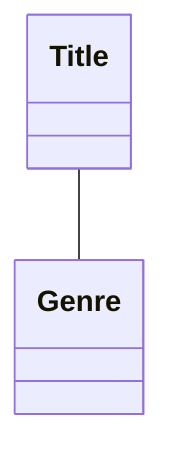
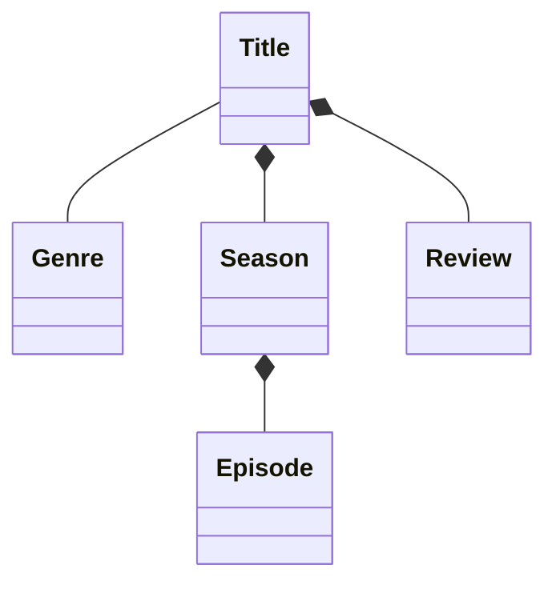
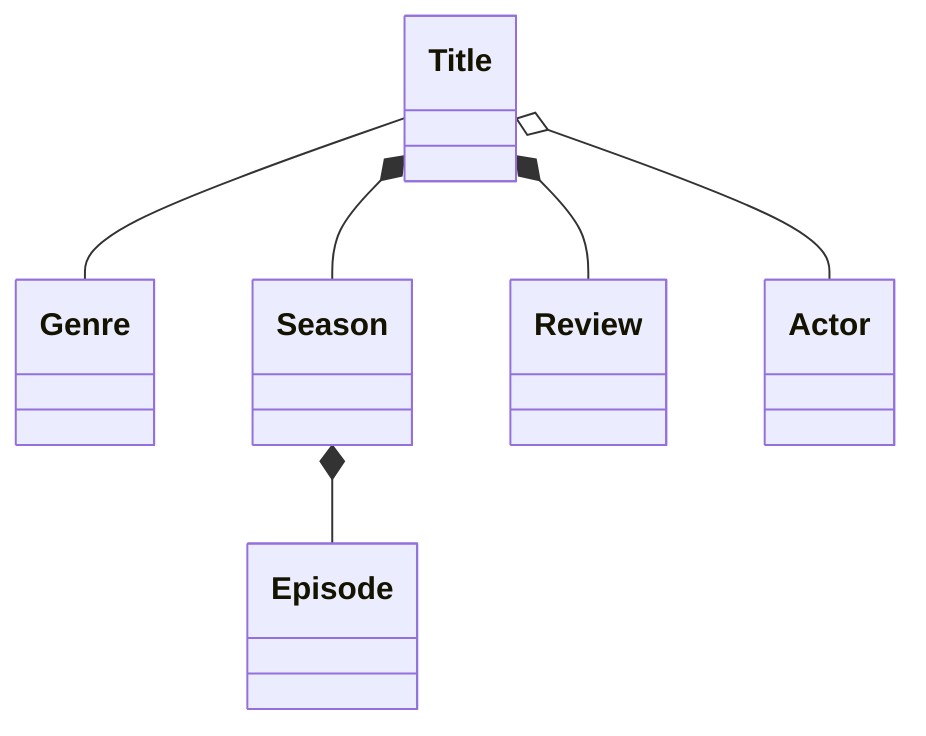

# UML Class Diagram Practice

## Step 1: Association

```mermaid
classDiagram
    Title -- Genre
```

## Step 2: Composition

```mermaid
classDiagram
    Title -- Genre
    Title *-- Season
    Title *-- Review
    Season *-- Episode
```

## Step 3: Aggregation

```mermaid
classDiagram
    Title -- Genre
    Title *-- Season
    Title *-- Review
    Title o-- Actor
    Season *-- Episode
```